 

# Antarctic Organisms

***

## **Our Study Species**
### *Trematomus bernacchii* ~ The Emerald Rock Cod

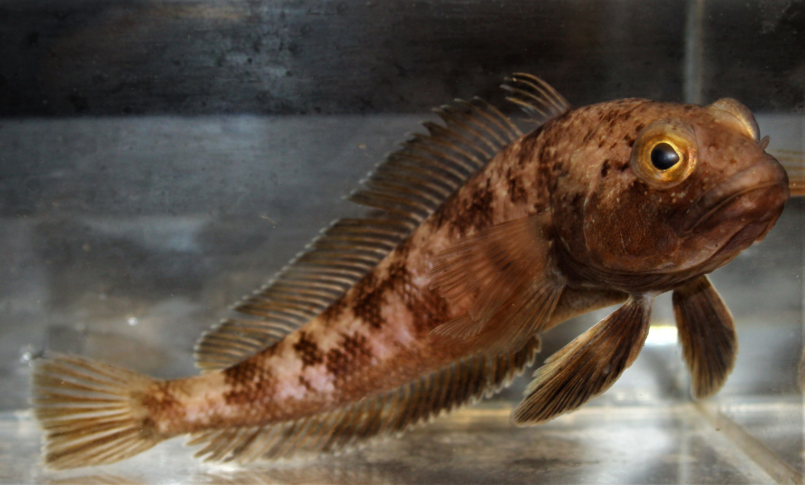

 

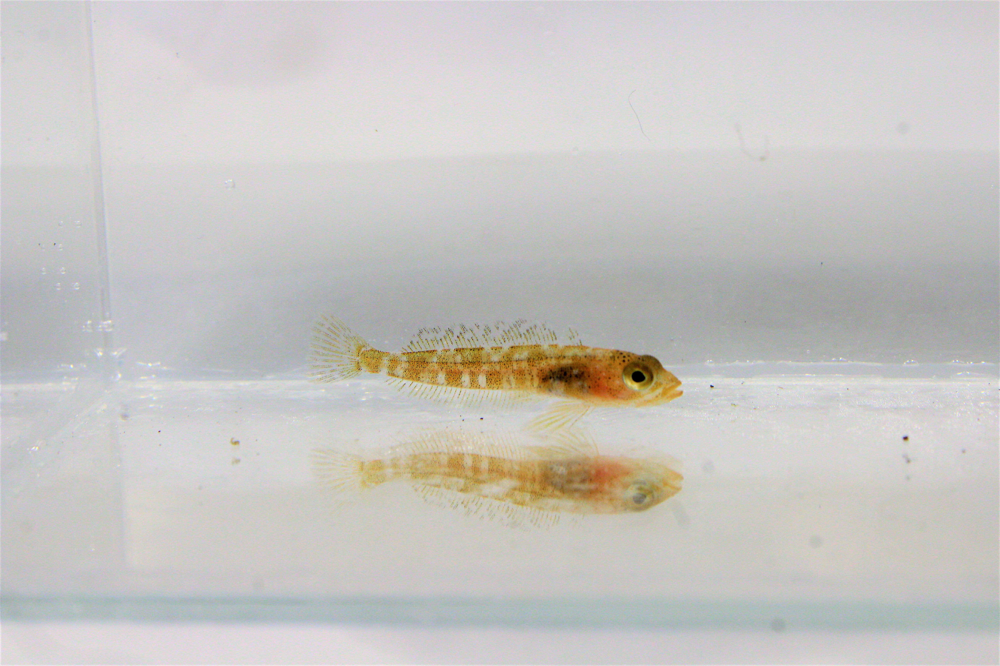
##### A juvenile bernie

 

This is our primary species of interest. This photograph is of an adult, while our research will primarily focus on larval and juvenile life stages. *T. bernachii* (or as well affectionately call them "bernies") is one of the dominant fish species in this region and is an important part of the food-web both as a predator of other fish (include its own species) as well as a food item for seals and the Antarctic toothfish *Dissostichus mawsoni*. 

***

## **Fish**

### *Trematomus pennellii* Sharp-spined notothen Trematomus 

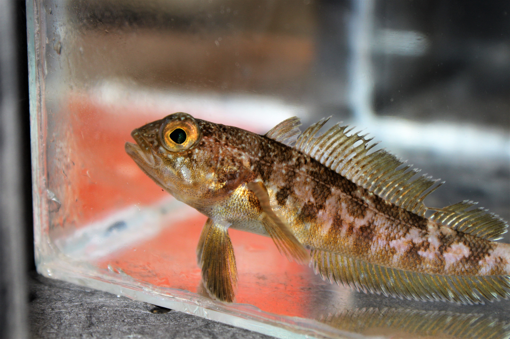
 

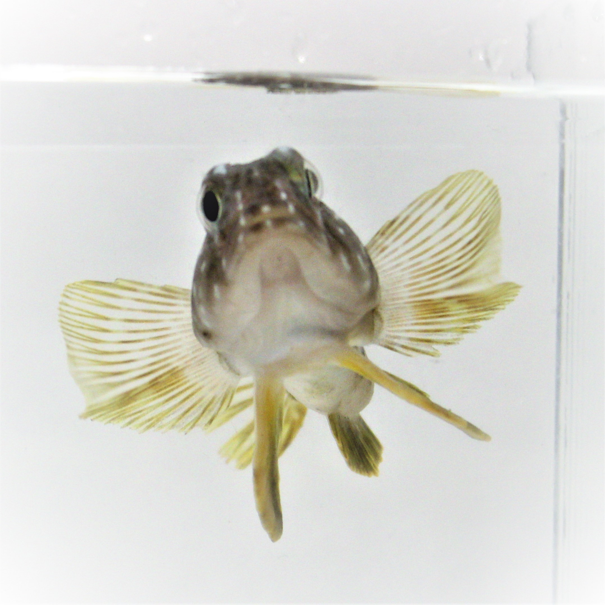
 

Another of the species we will be encountering. We hope to conduct research identifying the preferred temperature or temperatures of multiple antarctic fish species so that we may compare amongst species and look for differences. *T. pennellii* is a very close relative to *T. bernachii* and therefore any differences in thermal preference may underscore important differences in how these two species interact with their environment. 

***

### *Pagothenia borchgrevinki* The Bald Notothen
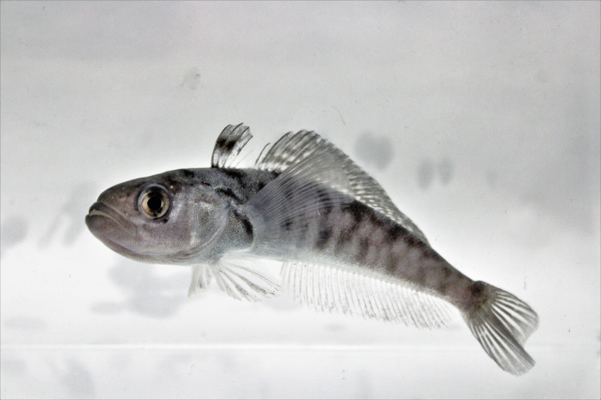
 
*Pagothenia borchgrevinki*, affectionately referred to as ‘Borks’ are one of the most common species of fish out here. They are somewhat unique in that they are found very close to, if not immediately, underneath the sea ice. They grow to be about a foot long, and are a mottled black and silver. 

We conducted some experiments on juvenile borks which gather in large schools that seem to hang underneath the ice. The borks, proved highly trainable and associated the presence of a human to food and would all gather at the surface eagerly awaiting dinner time. 

***
### *Trematomus nicolai* Spotted notothen
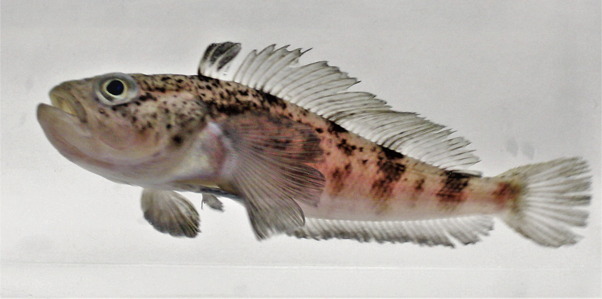
 

***

### *Trematomus newnesi* Dusky notothen
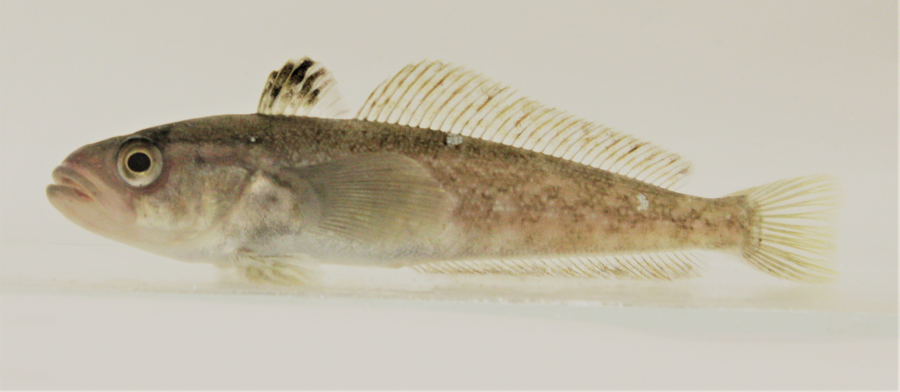
 

***

### *Trematomus hansoni* Striped notothen
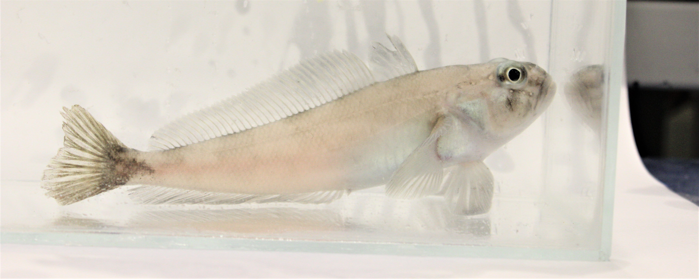
 

***

### *Trematomus loennbergii* Deepwater notothen

#####These fish are only found at depth and this one was caught in a trap at about 1200 feet down. 
 

***

### *Dissostichus mawsoni* Antarctic Toothfish 

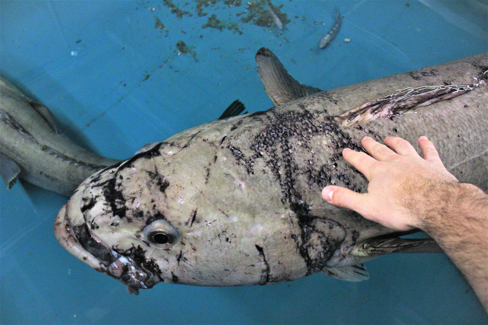
 

All hail the Antarctic Toothfish, or as we call it, the mawsoni (Maw-Son-I, cause that’s way cooler and technically its name). It’s a close relative of the Patagonia Toothfish, AKA Chilean seabass. Widespread desire for Chilean Seabass has depleated the Patagonian Toothfish so fishing fleets have begun to fish the Southern Ocean, including the Ross Sea for the mawsoni as a substitute.  This has led to an unsustainable fishing practice for this awesome fish.

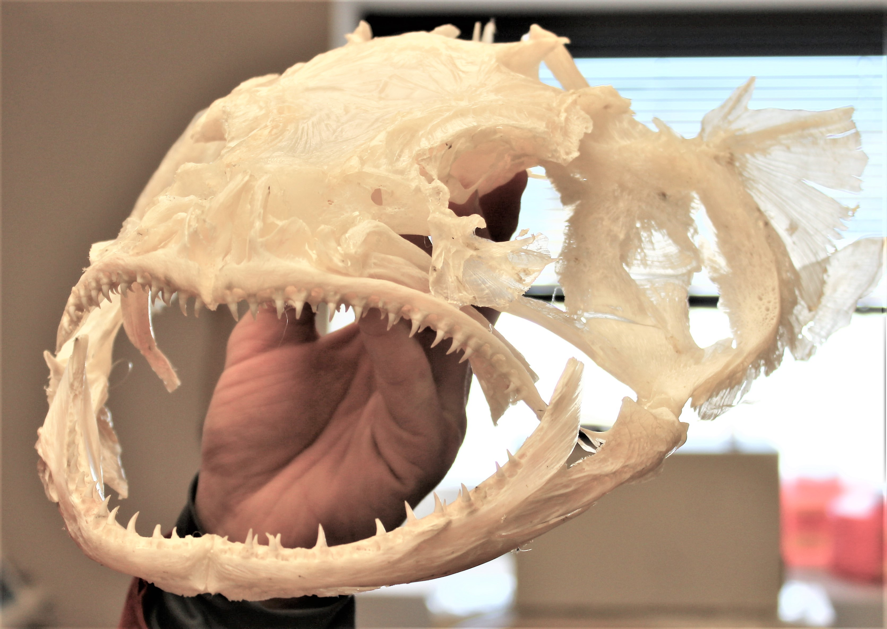
##### The skull of a mawsoni. Reconstructed by Macgregor Willis.
 

Here is some of what we do know. They are the largest fish species in the Southern Ocean (growing up to 6 feet long and well over 100lbs) and the dominant fish predator in the ecosystems down here. During the radiation of fish species around Antarctica, the mawsoni filled the niche of sharks. They are predated upon by Weddell seals (when juveniles) and killer whales when the ice is free. It is also thought that colossal squid may eat them as well. The Mawsoni will eat anything that can fit in its mouth and a large one, under the ice is an apex predator. If overfished, the loss of a top predatory would have large impacts on both the fish species on which it feeds, as well as the whale and seal populations which feed upon it. There is no understanding of where or when the mawsoni spawn or where the young larval fish hang out. 

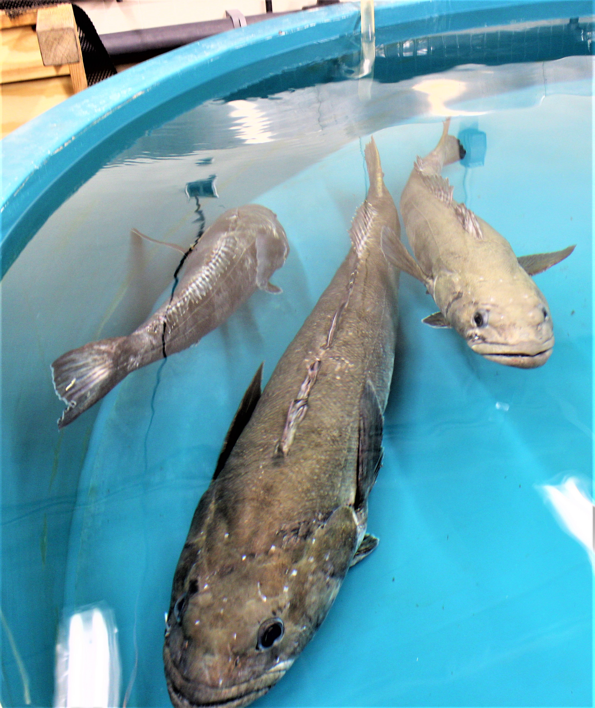
 

We were lucky enough to see some of these leviathans up close in the aquarium room, as one of the other research teams needed their blood to conduct some molecular experiments. 

***

Antarctica Sliverfish – Pleuragramma antarcticum

The Antarctic silverfish is the only truly pelagic fish in Antarctic waters. It is widespread and numerous but little is known about it as it is nearly impossible to capture at McMurdo as we can’t trawl for it with the sea covered in ice. This one was found in the stomach of a mawsoni that was brought into the lab. These fish are a massive part of the Antarctic food chain, eaten by penguins, seals, whales, and apparently mawsoni. 

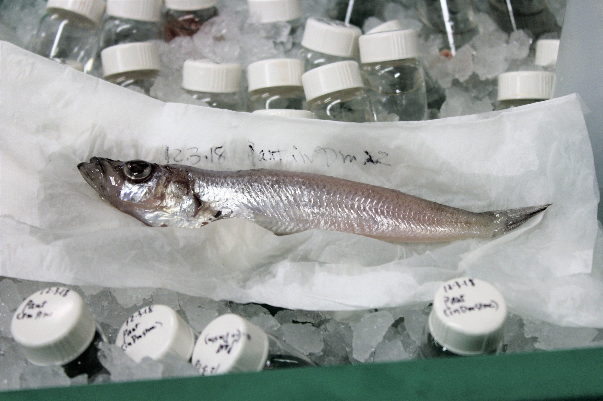
 

***

### *Gymnodraco acuticeps* The Naked Dragonfish
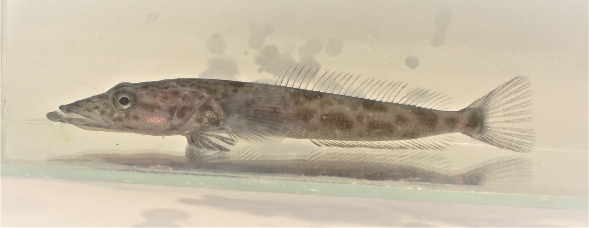
 

This is a dragonfish, one a few species found throughout Antarctica. Dragonfish are remarkable as they will guard their eggs until they hatch. Which is made more impressive as their eggs take ~10 months to do so. To guard their eggs, they have a few very large point teeth on their large lower jaw to ward off would-be predators of their eggs. They can grow to be over a foot long. 

***

### *Psilodraco breviceps* 

### *Lycodichthys dearborni* Antarctic Eel Pout
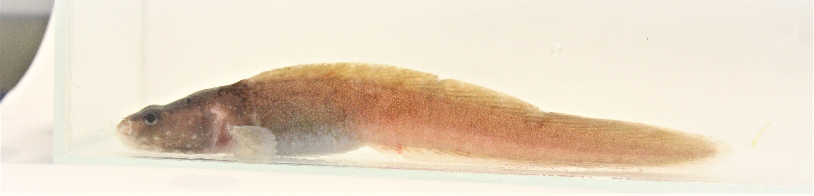
 

***

## **Other Creatures from Under the Ice**

The Diver's went out the other day and brought back things for the touch tank and a photoshoot. Here are some of the jems.

###*Cuthona crinita* Nudibranch

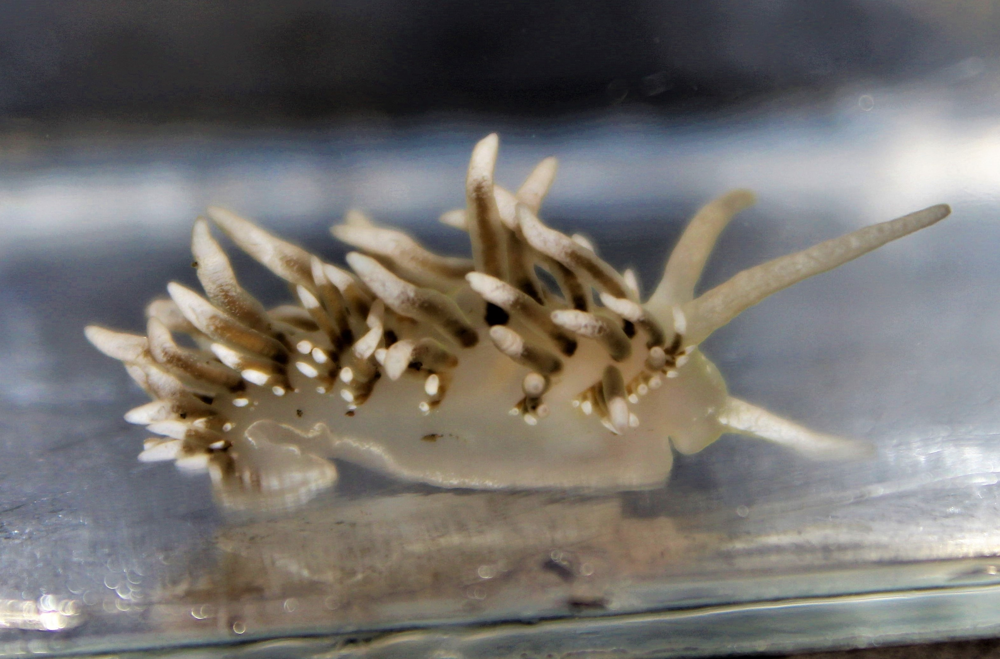
 

***

A local nudibranch to the McMurdo Sound. Approximately 1.5 inches in length. 
  

###*Pareledone sp.* Antarctic Octopus

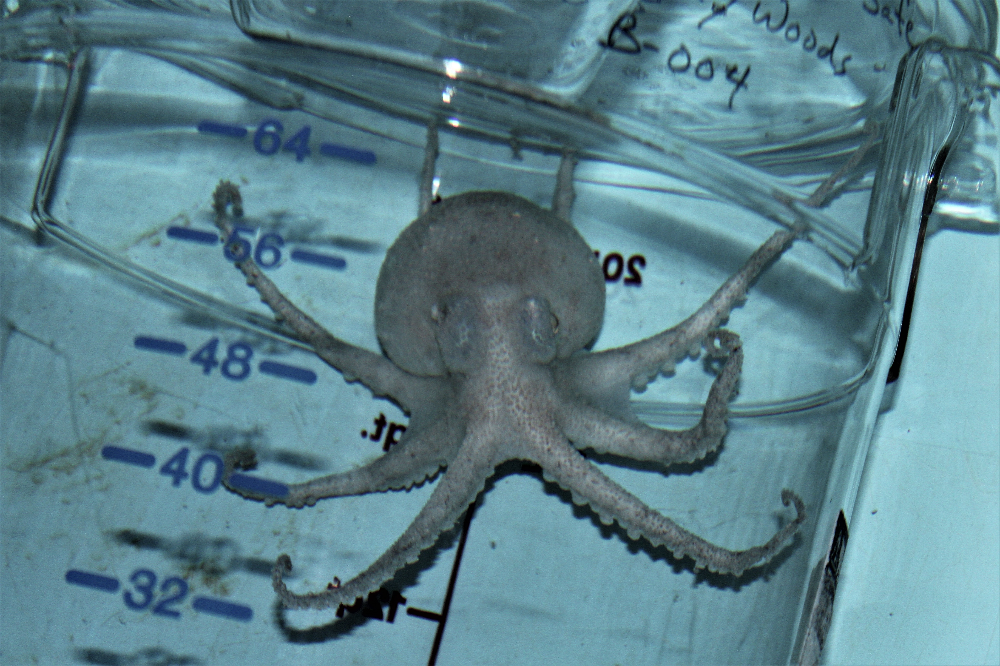

Everyone love's an octopus. This one has been named Oscar by the Crary Lab Staff. It is being housed in a seperate enclosed tank as Octopus are known escape artists that will crawl out of their tanks or down drain pipes. 

***

 

###*Colossendeis sp.* Antarctic Sea Spider

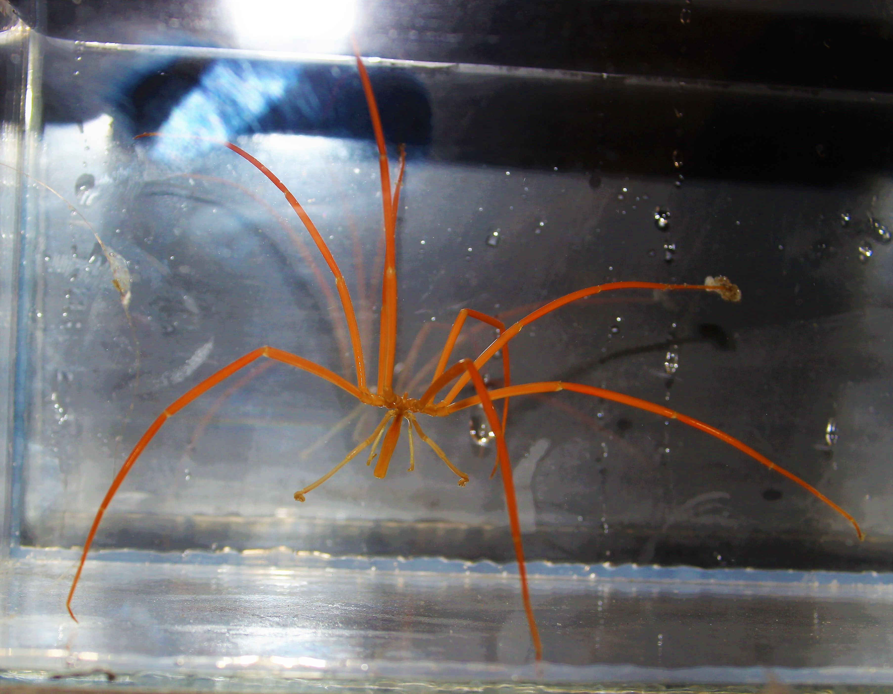

An example of Antarctc gigantism, these sea spiders can become unsually large. The one in this photo is 5" across.

***

### *Eusirus giganteus* Eusirid Amphipid

This little nightmare is an amphipod. One of many species of amphipods that live in Antarctic waters. This species is one of the largest around and is brightly colored pink and purple. They primarily scavenge and feed on other amphipods. 

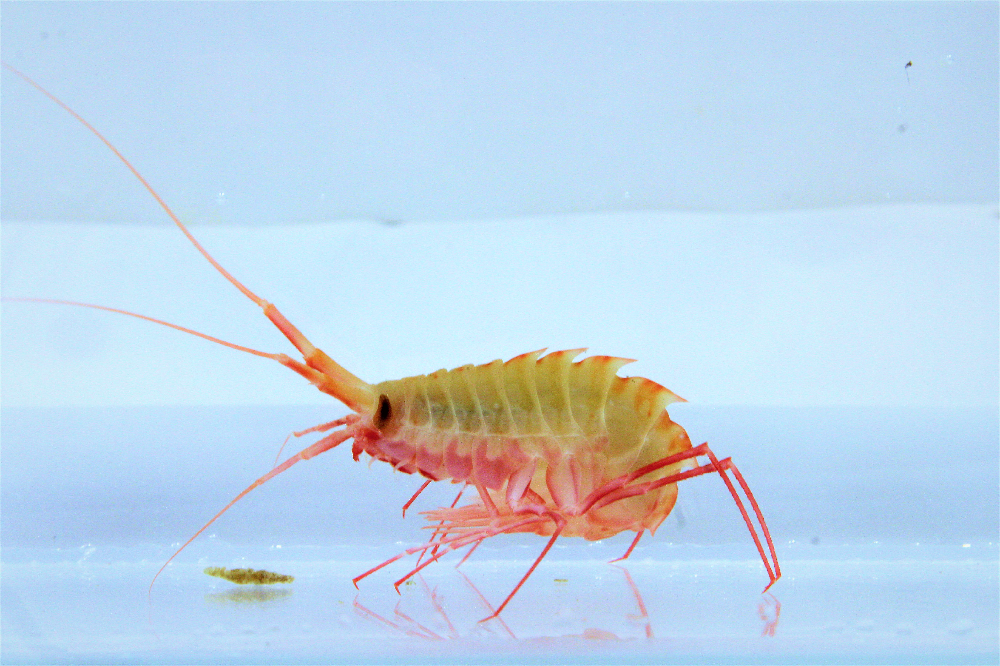
 

***

### *Glyptonotus antarcticus* Giant isopod
Serves ecologically as crabs or lobsters, ominovrous and at times cannibalistic. 
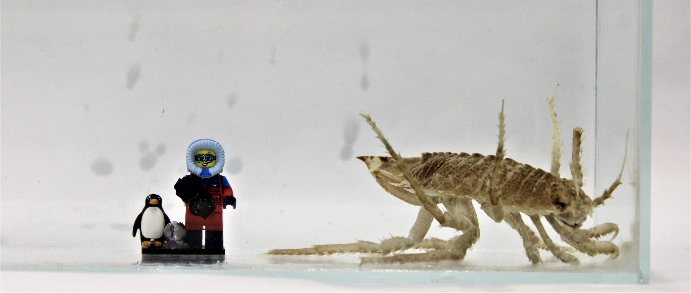
 

***

###

## **Birds**

###*Aptenodytes forsteri* Emperor Penguin

The classic symbol of Antarctica. The Emperor Penguin is the largest of all the Penguins and the only bird to breed south of the Antarctic circle during winter.

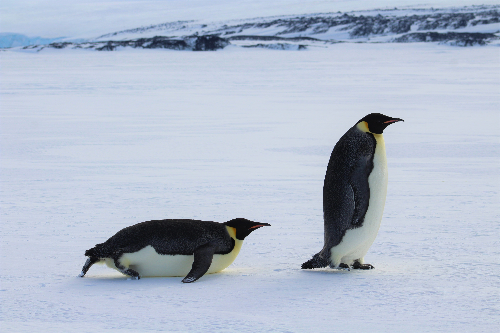

***

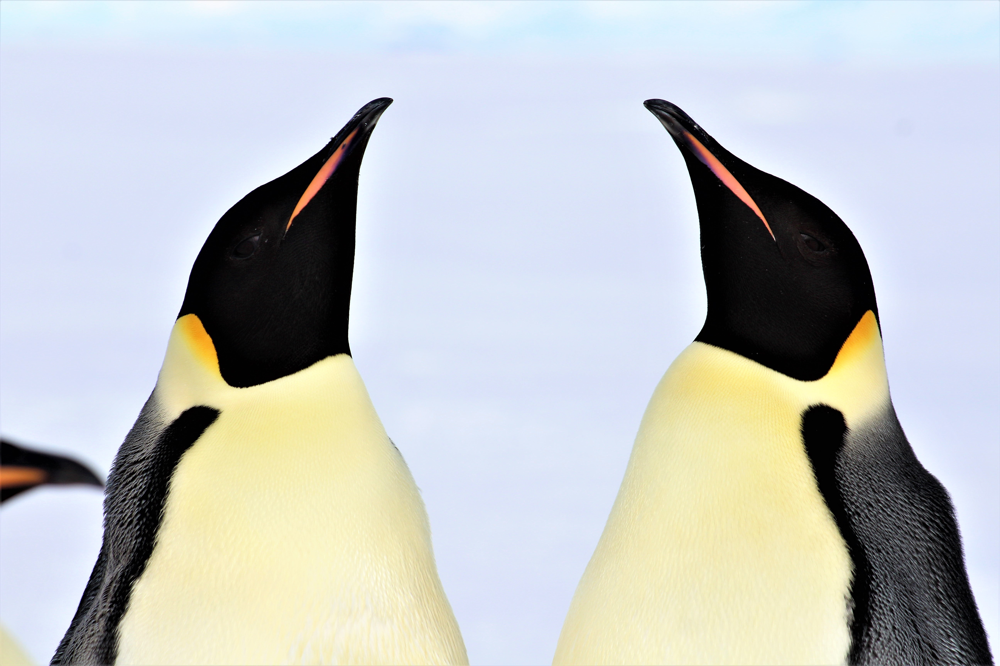

***

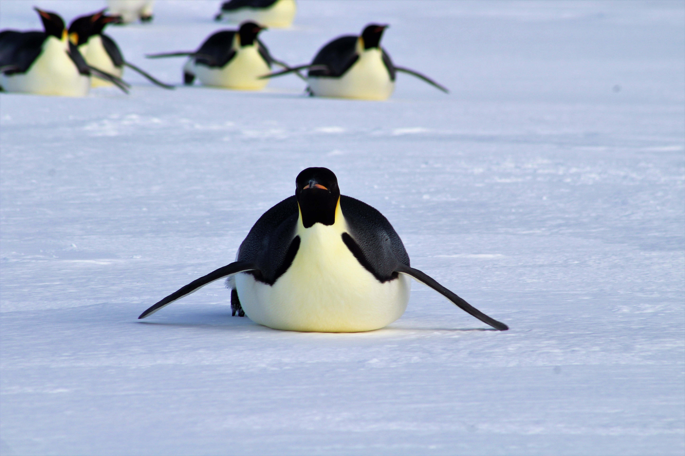

***

## **Mammals**

###*Leptonychotes weddellii* Weddell Seal

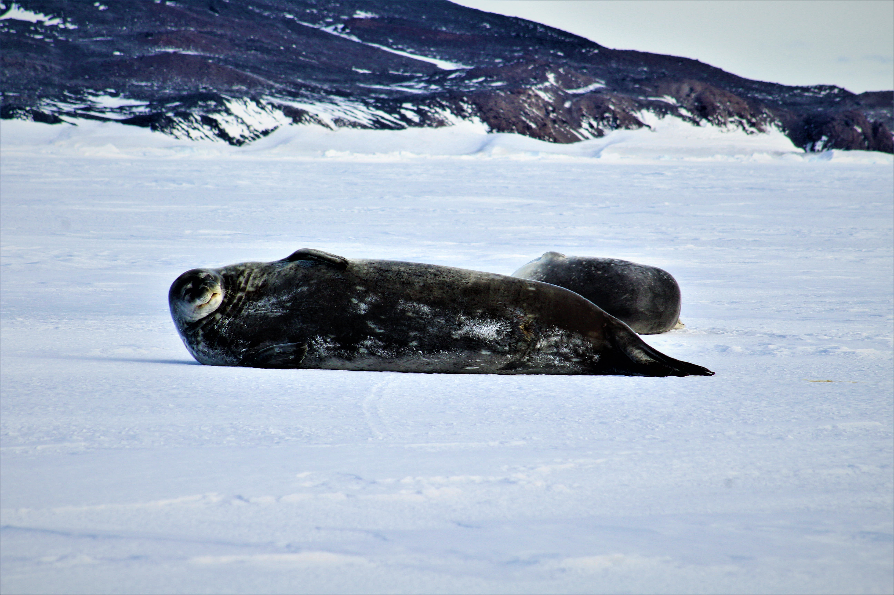

***

Aside from the humans there is only one mammal out here. The Weddell Seal. They are about 10ft long and will be pupping throughout the time we are hear. Keep posted for pictures of baby seals.

 

