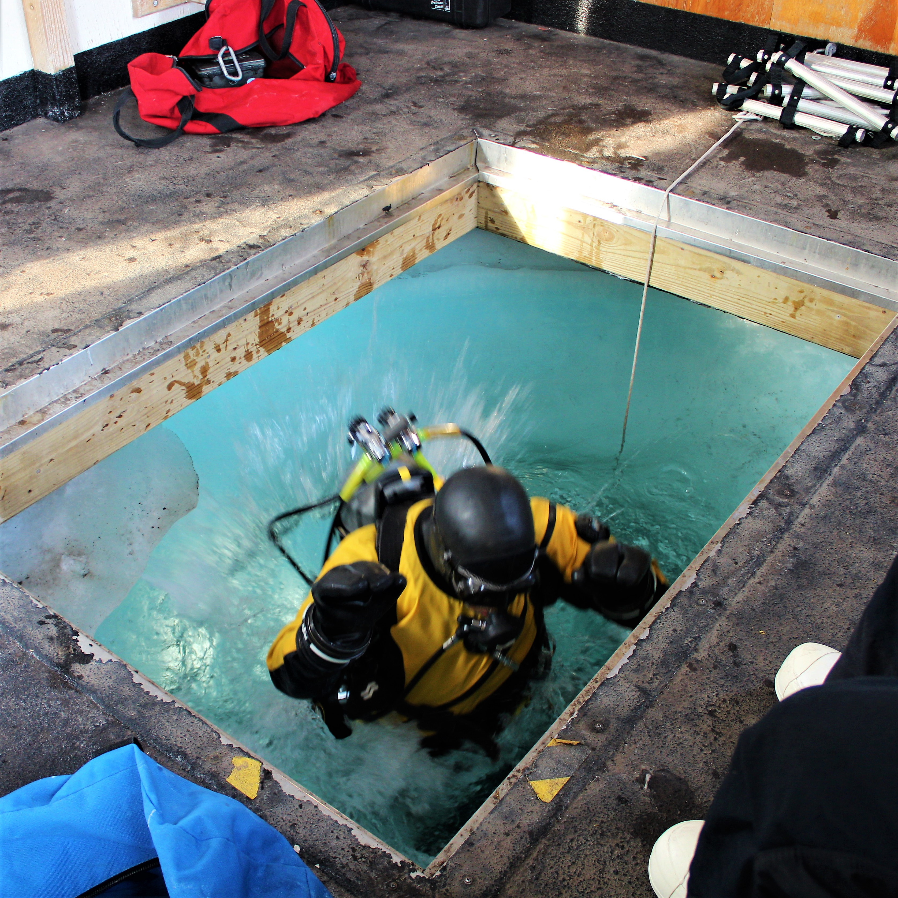

<br>

## Antarctic Expedition: B-207-M

***

## Welcome to the B-207-M expedition website!

We are excited to welcome you to our expedition website. Here we will blog about life at McMurdo Station, the research we are conducting and post photos of the frozen landscape and fascinating animals we encounter.

***

# Recent Posts!

#### *11.11.18 - Martha Wohlfeil (webmaster)*

The site is back up and running and up to date! Posts and photos will be coming in on a more regular basis! 

## Apologies

#### *10.31.18 - Ken Zillig*

Apologies for the lack of posts! There were some technical difficulties as well as some time constraints that prevented me from composing and publishing as often as I should have. Scroll through the pages to find a bunch of new pictures and blogs posts. There may be still be some photos missing as it the internet is very weak at McMurdo.

## Penguins
#### *10.31.18 - Ken Zillig*

Today we saw some penguins. On our voyage out to the Cape Evans Ice Wall we found some Emperor Penguins *Aptenodytes forsteri* just off the road way. We exited our Pisten Bullies and waited for them to approach. We had been told that the penguins are very curious creatures and will approach you. And so they did, the group of nine laid down on their bellies and slid across the ice to come and check us out. In the end all of them penguins were within feet of us. They had a strange intelligence about them, eyeing each of us individually trying to figure out what exactly we were. There has never been a 'land' predator in Antarctica, and therefore the Penguins were unafraid of our presences and would waddle between us and call out to one another as if we weren't there at all. At times it seemed they were calling to us, as if trying to make contact. They never appeared threatening and would have likely hung out with us all day if we hadn't left. 


***


***


***


***


## Cape Evans Ice Wall
#### *10.30.18 - Ken Zillig*

After much delay, we made our first foray out onto the sea ice proper. Today we traveled ~16 miles across frozen ocean to the Cape Evans Ice Wall, were we would drill a dive hole and put up a fish hut. Our caravan out to the site included three PistenBullies, one containing the divers, one containing a carpentry team and the last carrying ourselves. Following us was a Challenger Catepillar Tractor which towed on a giant sled, a fish hut, a snowplow and a massive ice auger. Once at the site, the drill team erected the auger and cored a 4ft wide hole through 6 feet of ice to the ocean below. Afterwhich we slid the fish hut over top and set about preparing for the dive team to go down and collect fish for us. 

The divers stay down for 45-50 minutes and net us as many juvenile *T. bernachii* as they can. Each fish is about an inch and a half long and the divers emerge towing plastic bags containing 50-100 of them.  The fish are then transported into an igloo cooler (the kind NFL players use for water) which is areated and filled with sea water. Trasnferring the fish is a very delicate process as the prescence of ice crystals or extended periods in air will overcome the fish's natural anti-freeze and induce a rapid snap freezing of their entire bodies. Great care is taken to prevent this from happening. 

After collection we all hop back into our PistenBullies for the 1.5-2 hour trip back to McMurdo. On the way we pass such landmarks as Inaccessible Island, Big Razorback Island and the Erebus Glaciar Tongue (A giant appendage of ice that is the end of the Erebus Glacier driving out to sea). As we drive along the ice road we can sea Weddell seals *Leptonychotes weddellii* and if were lucky even penguins. 



###### One of our divers, Rob Robbins, taking the plunge. This is currently Rob's 40th season diving at McMurdo.

***


###### A dive hole, recently drilled. When all the windows in the dive hut are closed, the only light emenates from the hole itself, reflected through the sea ice. 

##  A Day in the Life
#### *10.28.18 - Ken Zillig*

OUr lives have settled into a routine here at McMurdo. We wake up every day at 6:30 and make our way down to the galley for breakfast. Breakfast has been nicely varied and typically contains some variety of eggs and sausage, potatoesor hashbrowns. But ther are also always pastries, vegetables, and if were lucky, fresh fruit. By 7:30 we are in the lab and checking our CO~~2~~ system. We need to ensure that all the vlaves are compressors are working properly and that each tank is recieving the appropriate amount of water and bubbled CO~~2~~ mixture. After the systemm check and depending on the day we either spend the next few hours running water chemistry to verify our CO~~2~~ treatments are stable or get to work setting up the other experimetnal compoenents. Recently Andrew and I have been working on behavioral chambers that will allow us to test how CO~~2~~ and temperature influence fish behavior. Mandy has been working on setting up the metabolic test chambers.

At around noon we head to lunch which is typically some mix of pork, beef or chicken dishes. There is also a deli wher eyou can mak eyour own sandwhich or wrap. Pizza, more pastries and suprisingly good cookies are also available. We have been told taht the kitchen staff is targetting to feed us each ~4500 calories a day to ensure we stay warm in the cold weather. After lunch it is back to the lab to continue running seawater chemistry or building our respective projects. On some days we head out with the divers to aid them in catching fish off the McMurdo Jetty. Going to the jetty, which is maybe 100ft offshore is a welcome break form thelab and getsus excited to heat out on the sea ice in earnest.

Between 6 and 7 we will head to dinner. Diner is much like lunch, but typically there is some typ eof burger or taco bar where you can get food 'to order' as well as the typical food available. After dinner its back to the lab to wrap up any outstanding task form the day. Recently these have kept us in lab until 8:30 to 9. If we have the energy we may head to the bar or simply retire to our rooms to rest, write letters and watch T.V. By about 10:30 to 11:30 were in bed and fast asleep.

We expect this daily routine to be the norm for most of our time here in McMurdo, although punctuated by day-trips onto the sea ice to gather fish or opportuniteis to explore historical sites like Rober Falcon Scott's Antarctic Expedition Hut. 

## Arrival & Set-Up
#### *10.20.18 - Ken Zilig*

We made it! We arrived to Antarctica on the 17th of October to a sunny, clear and windy day. The temperature at the time was -34°C (-30°F). We travelled from the Pheonix Airfield to McMurdo Station via Ivan the Terra Bus. Since we have settled into our dorm rooms and begun to grow accoustomed to the constant day light. We have spent several long days in the lab working hard to get the experimental system set-up so that we can go out on the sea ice and collect our fish (pictures in the 'Antarctic Organisms' tab). We have recieved training in how to use GPS, drive a PistenBully, navigate sea ice and determine if cracks are safe to cross and field survival. So far the weather has been relatively pleasant and we hope that will continue.


###### Andrew and Ivan

***

## Departure
#### *10.15.2018 - Ken Zillig*

Well it has been a long time coming, but all signs point to tomorrow (October 16th) to be our departure date. We will be on either the first or second flight (2 planes are leaving tomorrow) to the ice for the season. I have heard rumors that this is the longest delay they have ever had getting the first flights of the season to McMurdo. 

Over the past two weeks we have made the most of our time in Christchurch. Andrew, Mandy and I have gotten out of the city and were able to enjoy some of the beautiful landscapes that New Zealand is known for. We also couldn't wait to see penguins so we tracked down some little blue penguins *Eudyptula minor* outside of Akaroa. Same goes for Great Spotted Kiwi Birds *Apteryx  haastii* which we visted at a nature reserve close to the airport. Being delayed in New Zealand is about as getting delayed gets, but we are eager to head south and get started on the research. 

***

 

###### A view of Akaroa Harbor from the top of Lighthouse Road

***


###### Little Blue Penguins at the Pohatu Marine Reserve

***

## Delayed - updated
#### *10.2.2018 - Ken Zillig*  

Good news / bad news today for the deployment. Good news; we were prioritized to be on the second flight down to the ice of the summer season. Bad news; there is persistent rough weather down at McMurdo. The station has its own [weather classification system](https://en.wikipedia.org/wiki/Antarctica_Weather_Danger_Classification), and for a couple hours this week it has been at “Condition 1” which includes one, if not more of the following:  

* Visibility less than 30 feet
* Wind speed over 63 mph
* Air temp or wind-chill below -100°F

Needless to say, they won’t be landing a plane in such conditions and as such we’ll have to wait until conditions improve. Currently we are scheduled to fly out on Oct. ~~3rd~~, ~~4th~~ ~~5th~~ ~~6th~~ ~~7-10th~~. 

But the day was not wasted! Today we received our ECW (extreme cold weather) gear. This gear is provided to us by the Antarctic program and is mandatory to be carried alongside you whenever you leave McMurdo Station to head into the field. Some notable pieces are “big red” the large down parka, and the “bunny boots” which have a valved air bladder to insulate you from the ground. The table below gives the full list of ECW gear as well as some pictures.

Today we also received some preliminary training on operating vehicles, waste disposal and fire safety. Along with a flu shot, given enmass by lining us all up and one-by-one injecting us with a vaccine dose. 

```{r echo = FALSE}
library(knitr)
# Add this list once i get stuff from USAP in Cristchurch
ECW.table <- data.frame("Item" = "Big Red" , "Number" = 1 )
ECW.table$Item <- as.character(ECW.table$Item)
ECW.table <- rbind(ECW.table, list("Bunny Boots", 1))
ECW.table <- rbind(ECW.table, list("Windpants", 1))
ECW.table <- rbind(ECW.table, list("Fleece Jacket", 1))
ECW.table <- rbind(ECW.table, list("Fleece Pants", 1))
ECW.table <- rbind(ECW.table, list("Hat", 1))
ECW.table <- rbind(ECW.table, list("Neck Gaiter", 1))
ECW.table <- rbind(ECW.table, list("Balaclava", 1))
ECW.table <- rbind(ECW.table, list("Gloves", 1))
ECW.table <- rbind(ECW.table, list("Mittens", 1))
ECW.table <- rbind(ECW.table, list("Glove Liners", 2))
ECW.table <- rbind(ECW.table, list("Goggles", 1))


kable(ECW.table)
```

***
  
 

<br>


<br>


***
## What is Our Research?
####  *9.29.18 ~ Ken Zillig*
The climate is changing. Anthropogenic uses of fossil fuels have produced carbon emissions that have increased the insulating capacity of the atmosphere. In essence wrapping the planet in a sweater that traps heat near the surface. These changes are having large influences around the globe and are making themselves more and more apparent, such as warmer winters, hotter summers, stronger fires and irregular weather patterns. However, less apparent is the effect that CO~2~ is having on the oceans.  
<br>
In the ocean, CO~2~ has two effects. One is the increasing of ocean surface temperatures similar to increasing surface temperatures elsewhere (AKA climate change). The other effect is more difficult to observe. CO~2~ is dissolving into the oceans and turning the ocean more acidic (AKA ocean acidification). This change is slight but can have profound impacts on sea life.  
<br>
The foundation of the oceans food web is made of tiny, microscopic organisms that make protective shells and armor from calcium carbonate. Calcium carbonate is similar to baking soda and like baking soda, it reacts with acid. Think of the vinegar and baking soda volcanos common at science fairs. While not as visually dramatic as the kitchen counter volcano, increasing ocean acidity makes it much more difficult for the tiny microorganisms of the ocean to build their calcium carbonate skeletons. This in turn reduces the amount of food produced at the bottom of the ocean food-web. Ocean acidification and rising temperatures has many other effects throughout the ocean. From challenging coral reefs (made of calcium carbonate and sensitive to temperature) to disrupting the brain chemistry of fish. Our research is seeking to explore how these two facets of carbon pollution will influence the physiology and ecology of Antarctic fishes.  
<br>
The fish of the Antarctic (our focal species) live in one of the most extreme and inhospitable places on earth. However, despite these challenges the day to day, year to year existence of these organisms is incredibly stable. The water is very cold, but the temperature hardly ever changes. The surface is routinely covered in a thick sheet of ice, and as such the bottom has remained isolated. The extended environmental stability has allowed Antarctic organisms to become habitat specialists, trading traits applicable to variable environments for those the promote living in Antarctica and nowhere else. Climate change and ocean acidification are expected to disrupt the environmental stability and the effects may be most pronounced in organisms with very specialized biology. Our research is to understand how these organisms may adapt or respond so that we may anticipate the biological and ecological changes that are coming to Antarctica.  
<br>
We are conducting several experiments, but they all stem from a few core treatments that we will be applying to Antarctic fish brought to the lab. Simply put we will expose fish to simulated environmental conditions representing present and future climate conditions. Fish will be exposed to two temperatures and three CO~2~ levels. Fish will be captured from the wild and placed within tanks with each tank having a different combination of temperature and CO~2~ treatments. Once exposed we will begin tracking how the behavior and physiology of fish exposed to different treatment changes over time.  
<br>
We hope that our research will help inform our scientific understanding of how increasing CO~2~ will affect Antarctic fish, as well as fish more generally. Our work is just a piece in a greater understanding of how CO~2~ pollution will impact ocean biology with implications for the Antarctic, commercial fishing and conservation.  


***

## Travelling to Antarctica
#### *9.15.2018 - Ken Zillig*
As you may expect, getting to Antarctica is a multiple day event. Our team will leave from San Francisco, CA on September 29th 2018 on route to Christchurch, by way of Auckland New Zealand. Once in Christchurch, we will have a day or two in which to receive our extreme cold weather gear (ECW) as well as any outstanding vaccinations and preliminary training. Christchurch is one of a few cities in the world that routes to Antarctica and is the specific point of entry for people traveling to McMurdo on the Ross Sea. Currently we are scheduled to leave for Antarctica on the second flight of the season (approx. Oct 3rd)
<br>
The trip down to McMurdo is weather dependent, and will only depart if we can land safely. Should a storm develop while we are in the air the plane is equipped to conduct a “boomerang” where it will turn around without landing and fly us back to Christchurch. All of this is done aboard an U.S. C-17 or LC-130 Cargo Plane.  

***
