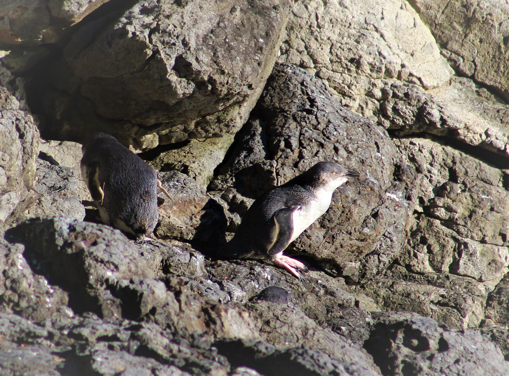

<br>

## Blog Posts

## Arrival & Set-Up
#### *10.20.18 - Ken Zilig*

We made it! We arrived to Antarctica on the 17th of October to a sunny, clear and windy day. The temperature at the time was -34°C (-30°F). We travelled from the Pheonix Airfield to McMurdo Station via Ivan the Terra Bus. Since we have settled into our dorm rooms and begun to grow accoustomed to the constant day light. We have spent several long days in the lab working hard to get the experimental system set-up so that we can go out on the sea ice and collect our fish (pictures in the 'Antarctic Organisms' tab). We have recieved training in how to use GPS, drive a PistenBully, navigate sea ice and determine if cracks are safe to cross and field survival. So far the weather has been relatively pleasant and we hope that will continue.


###### Andrew and Ivan

***

## Departure
#### *10.15.2018 - Ken Zillig*

Well it has been a long time coming, but all signs point to tomorrow (October 16th) to be our departure date. We will be on either the first or second flight (2 planes are leaving tomorrow) to the ice for the season. I have heard rumors that this is the longest delay they have ever had getting the first flights of the season to McMurdo. 

Over the past two weeks we have made the most of our time in Christchurch. Andrew, Mandy and I have gotten out of the city and were able to enjoy some of the beautiful landscapes that New Zealand is known for. We also couldn't wait to see penguins so we tracked down some little blue penguins *Eudyptula minor* outside of Akaroa. Same goes for Great Spotted Kiwi Birds *Apteryx  haastii* which we visted at a nature reserve close to the airport. Being delayed in New Zealand is about as getting delayed gets, but we are eager to head south and get started on the research. 

***

 

###### A view of Akaroa Harbor from the top of Lighthouse Road

***



###### Little Blue Penguins at the Pohatu Marine Reserve

***


## Delayed - updated
#### *10.2.2018 - Ken Zillig*  

Good news / bad news today for the deployment. Good news; we were prioritized to be on the second flight down to the ice of the summer season. Bad news; there is persistent rough weather down at McMurdo. The station has its own [weather classification system](https://en.wikipedia.org/wiki/Antarctica_Weather_Danger_Classification), and for a couple hours this week it has been at “Condition 1” which includes one, if not more of the following:  

* Visibility less than 30 feet
* Wind speed over 63 mph
* Air temp or wind-chill below -100°F

Needless to say, they won’t be landing a plane in such conditions and as such we’ll have to wait until conditions improve. Currently we are scheduled to fly out on Oct. ~~3rd~~, ~~4th~~ ~~5th~~ ~~6th~~ ~~7-10th~~. 

But the day was not wasted! Today we received our ECW (extreme cold weather) gear. This gear is provided to us by the Antarctic program and is mandatory to be carried alongside you whenever you leave McMurdo Station to head into the field. Some notable pieces are “big red” the large down parka, and the “bunny boots” which have a valved air bladder to insulate you from the ground. The table below gives the full list of ECW gear as well as some pictures.

Today we also received some preliminary training on operating vehicles, waste disposal and fire safety. Along with a flu shot, given enmass by lining us all up and one-by-one injecting us with a vaccine dose. 

```{r echo = FALSE}
library(knitr)
# Add this list once i get stuff from USAP in Cristchurch
ECW.table <- data.frame("Item" = "Big Red" , "Number" = 1 )
ECW.table$Item <- as.character(ECW.table$Item)
ECW.table <- rbind(ECW.table, list("Bunny Boots", 1))
ECW.table <- rbind(ECW.table, list("Windpants", 1))
ECW.table <- rbind(ECW.table, list("Fleece Jacket", 1))
ECW.table <- rbind(ECW.table, list("Fleece Pants", 1))
ECW.table <- rbind(ECW.table, list("Hat", 1))
ECW.table <- rbind(ECW.table, list("Neck Gaiter", 1))
ECW.table <- rbind(ECW.table, list("Balaclava", 1))
ECW.table <- rbind(ECW.table, list("Gloves", 1))
ECW.table <- rbind(ECW.table, list("Mittens", 1))
ECW.table <- rbind(ECW.table, list("Glove Liners", 2))
ECW.table <- rbind(ECW.table, list("Goggles", 1))


kable(ECW.table)
```

***
  
 

<br>


<br>


***

## Packing for Antarctica

> The requisite gear for Antarctica is quite varied. Here I have broken out my gear by type.
> 

```{r echo = FALSE}
library(knitr)

clothes.table <- data.frame("Item" = "Lightweight Thermal Shirt", "Number" = c(6))
clothes.table$Item <- as.character(clothes.table$Item)
clothes.table <- rbind(clothes.table,list("Midweight Thermal Shirt", 3))
clothes.table <- rbind(clothes.table,list("Heavyweight Thermal Shirt", 1))
clothes.table <- rbind(clothes.table,list("Fleece Pullover", 1))
clothes.table <- rbind(clothes.table,list("Knit Sweater Pullover", 1))
clothes.table <- rbind(clothes.table,list("Down Puffy Coat", 2))
clothes.table <- rbind(clothes.table,list("Down Vest", 1))
clothes.table <- rbind(clothes.table,list("Sweatshirt", 1))
clothes.table <- rbind(clothes.table,list("Lightweight Thermal Pants", 3))
clothes.table <- rbind(clothes.table,list("Midweight Thermal Pants", 4))
clothes.table <- rbind(clothes.table,list("Fleece Lined Work Pants", 2))
clothes.table <- rbind(clothes.table,list("Jeans", 1))
clothes.table <- rbind(clothes.table,list("Underwear", 14))


clothes.table <- rbind(clothes.table,list("Windstopper Hat", 2))
clothes.table <- rbind(clothes.table,list("Balaclava", 1))
clothes.table <- rbind(clothes.table,list("Sheepskin Hat", 1))
clothes.table <- rbind(clothes.table,list("Gloves", 1))

clothes.table <- rbind(clothes.table,list("Liner Socks", 6))
clothes.table <- rbind(clothes.table,list("Wool Socks", 7))

clothes.table <- rbind(clothes.table,list("Socks", 2))
clothes.table <- rbind(clothes.table,list("Approach Shoes", 1))
clothes.table <- rbind(clothes.table,list("Flip-flops", 1))
clothes.table <- rbind(clothes.table,list("Slippers", 1))
clothes.table <- rbind(clothes.table,list("Sunglasses", 2))
clothes.table <- rbind(clothes.table,list("Casio Watch", 1))

clothes.table <- rbind(clothes.table,list("Sandals (for New Zealand)", 1))
clothes.table <- rbind(clothes.table,list("Raincoat (for New Zealand)", 1))
clothes.table <- rbind(clothes.table,list("T-Shirt (for New Zealand)", 2))
clothes.table <- rbind(clothes.table,list("Shorts (for New Zealand)", 1))
#clothes.table

kable(clothes.table)

gear.table <- data.frame("Item" = "Camera Related" , "Number" = 0 )
gear.table$Item <- as.character(gear.table$Item)
gear.table <- rbind(gear.table, list(" -- Cannon Rebel Ti6 DSLR", 1))
gear.table <- rbind(gear.table, list(" -- Cannon 75-300mm Lens", 1))
gear.table <- rbind(gear.table, list(" -- Cannon 18-55mm Lens", 1))
gear.table <- rbind(gear.table, list(" -- Camera Batteries", 3))
gear.table <- rbind(gear.table, list(" -- Bird Guide For Antarctica and New Zealand", 1))

gear.table <- rbind(gear.table, list("Recreation", 0))
gear.table <- rbind(gear.table, list(" -- Hiking Boots", 1))
gear.table <- rbind(gear.table, list(" -- Daypack", 1))
gear.table <- rbind(gear.table, list(" -- La Sportiva Muiras", 1))
gear.table <- rbind(gear.table, list(" -- Climbing harness", 1))
gear.table <- rbind(gear.table, list(" -- ATC", 1))
gear.table <- rbind(gear.table, list("Art", 0))
gear.table <- rbind(gear.table, list(" -- Watercolor and Paintbrushes (set)", 1))
gear.table <- rbind(gear.table, list(" -- Micron Pens (set)", 1))
gear.table <- rbind(gear.table, list(" -- Drawing Pencils (set)", 1))
gear.table <- rbind(gear.table, list(" -- Sketchbook", 1))
gear.table <- rbind(gear.table, list("Laboratory", 0))
gear.table <- rbind(gear.table, list(" -- Leatherman", 1))
gear.table <- rbind(gear.table, list(" -- Little Green Notebook", 1))
gear.table <- rbind(gear.table, list(" -- Lab Notebook", 2))

gear.table <- rbind(gear.table, list("Tech", 0))
gear.table <- rbind(gear.table, list(" -- Dell XPS 15 and charger", 1))
gear.table <- rbind(gear.table, list(" -- USB Charging Adapter", 2))
gear.table <- rbind(gear.table, list(" -- iPhone", 1))
gear.table <- rbind(gear.table, list(" -- Kindle Fire", 1))
gear.table <- rbind(gear.table, list(" -- External Harddrive", 1))
gear.table <- rbind(gear.table, list(" -- Headphones", 1))
gear.table <- rbind(gear.table, list(" -- PC Gaming Controller", 1))

gear.table <- rbind(gear.table, list("REI 34 Big Haul Rolling Suitcase" , 1))
gear.table <- rbind(gear.table, list("Black Diamond Demon Duffel", 1))
gear.table <- rbind(gear.table, list("Laptop Backpack", 1))

#gear.table

kable(gear.table)

other.table <- data.frame("Item" = "Toiletries" , "Number" = 0 )
other.table$Item <- as.character(other.table$Item)
other.table <- rbind(other.table, list(" -- Shampoo", 1))
other.table <- rbind(other.table, list(" -- Contact Solution", 1))
other.table <- rbind(other.table, list(" -- Contacts (pairs)", 6))
other.table <- rbind(other.table, list(" -- Body Wash", 1))
other.table <- rbind(other.table, list(" -- Sunscreen", 1))

other.table <- rbind(other.table, list("Other", 0))
other.table <- rbind(other.table, list(" -- Envelopes", 100))
other.table <- rbind(other.table, list(" -- Pens", 10))
other.table <- rbind(other.table, list(" -- Stamps", 60))
other.table <- rbind(other.table, list(" -- Stationary Notebook", 1))
other.table <- rbind(other.table, list(" -- Tupperware", 1))

kable(other.table)


# Add this list once i get stuff from USAP in Cristchurch
ECW.table <- data.frame("Item" = "Big Red" , "Number" = 1 )
ECW.table$Item <- as.character(ECW.table$Item)
ECW.table <- rbind(ECW.table, list("Bunny Boots", 1))
ECW.table <- rbind(ECW.table, list("Windpants", 1))
ECW.table <- rbind(ECW.table, list("Fleece Jacket", 1))
ECW.table <- rbind(ECW.table, list("Hat", 1))
ECW.table <- rbind(ECW.table, list("Gloves", 1))
ECW.table <- rbind(ECW.table, list("Goggles", 1))
ECW.table <- rbind(ECW.table, list("Neck Gaiter", 1))
ECW.table <- rbind(ECW.table, list("", 1))


```

***


## Travelling to Antarctica
#### *9.15.2018 - Ken Zillig*
As you may expect, getting to Antarctica is a multiple day event. Our team will leave from San Francisco, CA on September 29th 2018 on route to Christchurch, by way of Auckland New Zealand. Once in Christchurch, we will have a day or two in which to receive our extreme cold weather gear (ECW) as well as any outstanding vaccinations and preliminary training. Christchurch is one of a few cities in the world that routes to Antarctica and is the specific point of entry for people traveling to McMurdo on the Ross Sea. Currently we are scheduled to leave for Antarctica on the second flight of the season (approx. Oct 3rd)
<br>
The trip down to McMurdo is weather dependent, and will only depart if we can land safely. Should a storm develop while we are in the air the plane is equipped to conduct a “boomerang” where it will turn around without landing and fly us back to Christchurch. All of this is done aboard an U.S. C-17 or LC-130 Cargo Plane.  

***
