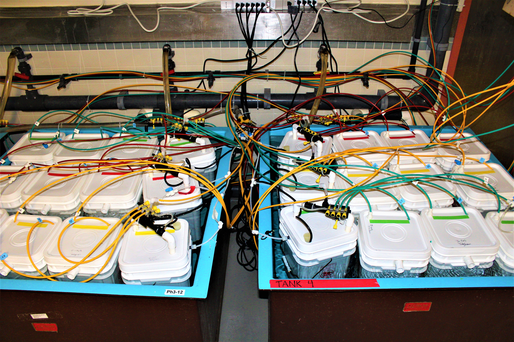
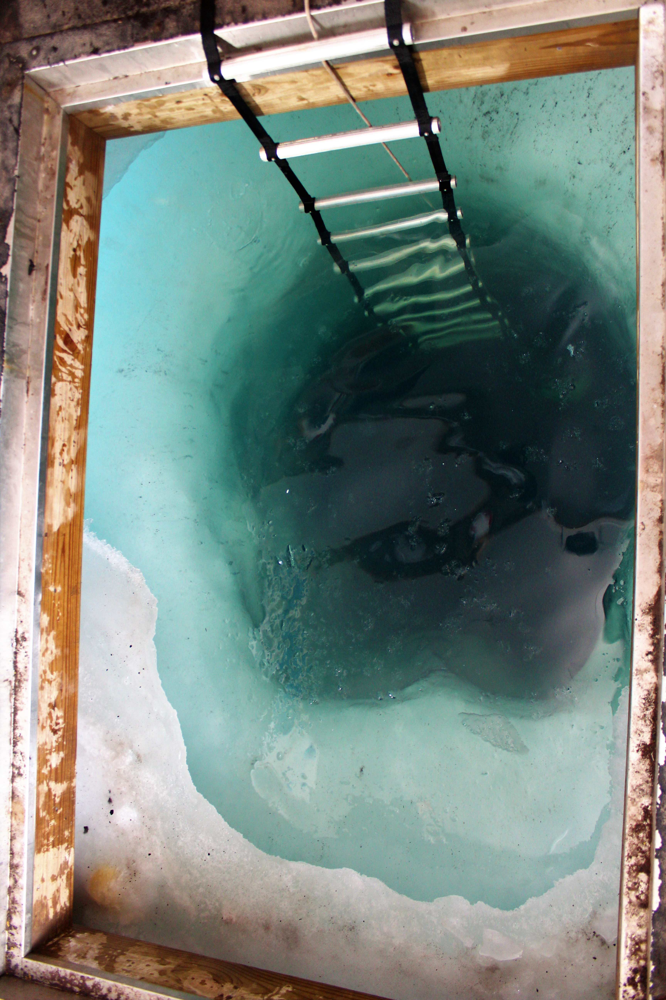

 

# Research Updates

## Cape Evans Ice Wall
#### *10.30.18 - Ken Zillig*

After much delay, we hvemade our fist foray out onto the sea ice proper. Today we traveled ~16 miles across frozen ocean to the Cape Evans Ice Wall, where we would drill a dive hole and put up a fish hut. OUr caravan out to the site includ three PistenBullies, one containing the divers, one containing a carpentry team and the last carrying ourselves. Following us was a Challngere catepillar tractor which towed, on a giant sled, a fish hut, a snow plow and a massive ice auger. Once at the site, the drill team ereeted teh auger and cored a 4ft wide hole through 6 feet of ice to the ocean below. Afterwhich we slid the fish hut over top and set about preparing for the dive team to go down and collect fish for us.

The divers stay down for 45-50 minutes and net us as many juvenile *T. bernachii* as they can. Each fish is about an inch and a hlaf long and the divers emerge towing plastic bags containing 50-100 of them. THe fis are then trasnported into an ingloo cooler (the kind NFL plauers use for water) which is aerated and filled with sea water.  Trasnferring the fish is a very delicate process a the presecence of the ice crystals or extended periods in air will overcome the fish's natural anti-freeze and induce a rapid snap freezing of their entire bodies. Freat care is taken to prevent this from happening. 

After collextion we all hop back into our PistenBullies for the 1.5-2 hours trip back to McMurdo. On the way we pass such landmarks as Inaccessible Island, Big Razorback Island and the Erebus Glacier Tongue (a giant appendage of ice that is the end of the Erebus Glacier driving out into the sea). As we drive along the ice road we can see weddell seals *Leptonychotes weddellii* and if were lucky even penguins.

## Set-Up
#### *10.24.18 ~ Ken Zillig*
Everyday since we arrived we have been working to set-up our experimental treatments. We are seeking to understand how fish (*T. bernachii* in particular) will respond physiologically to the climate conditions of the future. To do so we have to construct and establish tiny little ocean's of our own that reflect potential future cliamte conditions. We do this in two ways, first we control the temperature of the water. In the picture below, each of the four large square tanks is at a specific temperature. Two are at -1°C and the other two are at 2°C. This represents the current temeprature (-1°C) and a water temperature under future climate conditions (2°C). We also expose the water to three different concentrations of CO~2~. This can be seen by the different colored tubes running to into the buckets. Each color tube containes a precisely measured mixture of CO~2~ and air that is then dissovled into seawater and pumped into the buckets. The three CO~2~ concentrations reflect the current CO~2~ conditions (green: 450 µatm), a future where greenhouse gas emissions and CO~2~ are brought under control (yellow: 850 µatm), and a future where CO~2~ emissions remain unchecked (red: 1200 µatm). This experimetnal set-up leads to 6 treatment groups. 

Once the system equillibrates and we verify that the concentrations of CO~2~ then we will begin adding fish to the buckets. The fish will begin to adjust their physiology to these new environemtnal conditions. This **acclimation** will occur over days to weeks and involves changes in the proteins a fish is producing, how it regulates salt concentrations, how it allocates energey resources and even how its behaves. Increase in temperature may be stressful and a fish may respond in all sorts of ways. It may be less active to conserve energy or it may seek out prey and eat more readily. The fish may also produce proteins that protect its cells and tissues from heat stress. Increasing CO~2~ increase the acidity of the ocean. Increasing acidity has been shown to interfere with the brain chemistry in other fish species, leading to strange behavioral response. Furthermore, how these two factors (CO~2~ and temperature) interact is poorly understood, and research has shown that organisms often respond to multiple stressful condtiions in strange and counter-intuitive ways. Over the course of our project fish will be housed continually at the above conditions. We will then, every week, collect data on their behavior, metabolism, and cellular physiology. This process should enable us to capture the physiological and behavioral changes that occur as a fish acclimates to future climate conditions. Our research will attempt to answer questions accross many aspects of fish physiology and behavior, with the hope of understanding more how future climate conditions (temperature and dissolved CO~2~) will affect the sensitive fish of McMurdo Sound and the Antarctic.

***

***
## What is Our Research?
####  *9.18.18 ~ Ken Zillig*
The climate is changing. Anthropogenic uses of fossil fuels have produced carbon emissions that have increased the insulating capacity of the atmosphere. In essence wrapping the planet in a sweater that traps heat near the surface. These changes are having large influences around the globe and are making themselves more and more apparent, such as warmer winters, hotter summers, stronger fires and irregular weather patterns. However, less apparent is the effect that CO~2~ is having on the oceans.  
 
In the ocean, CO~2~ has two effects. One is the increasing of ocean surface temperatures similar to increasing surface temperatures elsewhere (AKA climate change). The other effect is more difficult to observe. CO~2~ is dissolving into the oceans and turning the ocean more acidic (AKA ocean acidification). This change is slight but can have profound impacts on sea life.  
 
The foundation of the oceans food web is made of tiny, microscopic organisms that make protective shells and armor from calcium carbonate. Calcium carbonate is similar to baking soda and like baking soda, it reacts with acid. Think of the vinegar and baking soda volcanos common at science fairs. While not as visually dramatic as the kitchen counter volcano, increasing ocean acidity makes it much more difficult for the tiny microorganisms of the ocean to build their calcium carbonate skeletons. This in turn reduces the amount of food produced at the bottom of the ocean food-web. Ocean acidification and rising temperatures has many other effects throughout the ocean. From challenging coral reefs (made of calcium carbonate and sensitive to temperature) to disrupting the brain chemistry of fish. Our research is seeking to explore how these two facets of carbon pollution will influence the physiology and ecology of Antarctic fishes.  
 
The fish of the Antarctic (our focal species) live in one of the most extreme and inhospitable places on earth. However, despite these challenges the day to day, year to year existence of these organisms is incredibly stable. The water is very cold, but the temperature hardly ever changes. The surface is routinely covered in a thick sheet of ice, and as such the bottom has remained isolated. The extended environmental stability has allowed Antarctic organisms to become habitat specialists, trading traits applicable to variable environments for those the promote living in Antarctica and nowhere else. Climate change and ocean acidification are expected to disrupt the environmental stability and the effects may be most pronounced in organisms with very specialized biology. Our research is to understand how these organisms may adapt or respond so that we may anticipate the biological and ecological changes that are coming to Antarctica.  
 
We are conducting several experiments, but they all stem from a few core treatments that we will be applying to Antarctic fish brought to the lab. Simply put we will expose fish to simulated environmental conditions representing present and future climate conditions. Fish will be exposed to two temperatures and three CO~2~ levels. Fish will be captured from the wild and placed within tanks with each tank having a different combination of temperature and CO~2~ treatments. Once exposed we will begin tracking how the behavior and physiology of fish exposed to different treatment changes over time.  
 
We hope that our research will help inform our scientific understanding of how increasing CO~2~ will affect Antarctic fish, as well as fish more generally. Our work is just a piece in a greater understanding of how CO~2~ pollution will impact ocean biology with implications for the Antarctic, commercial fishing and conservation.  

***

