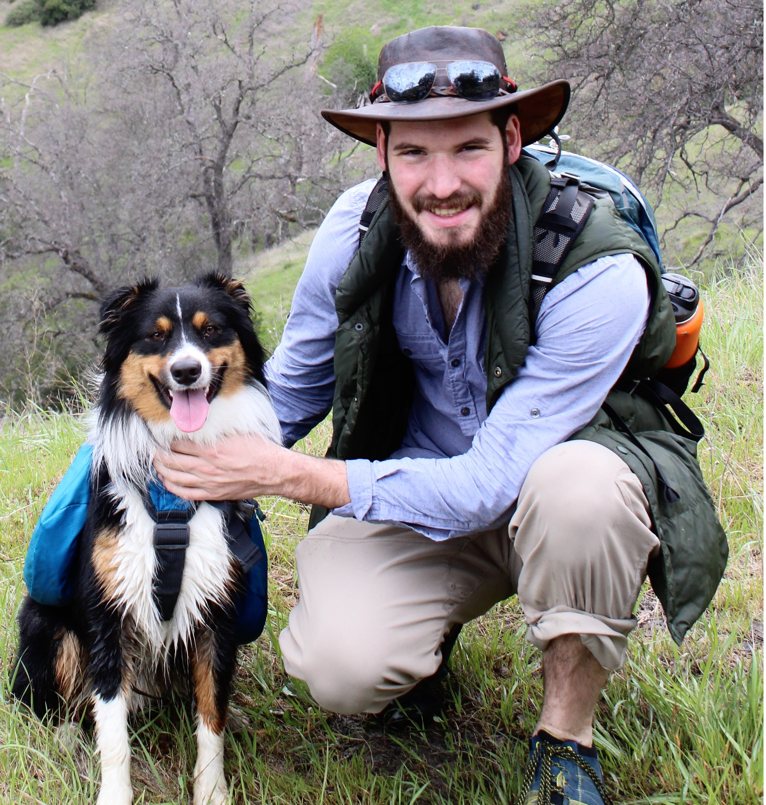

 

##Expedition Team

***

## **Ken W. Zillig**
### UC Davis, Graduate Group in Ecology, Ph.D. Candidate

I am a fourth year in the Graduate Group in Ecology at UC Davis. My Ph.D. research revoles around interpopulation variation in Chinook salmon and how differences in the thermal biology between populations can contribute to conservation solutions. Generally, my work focuses on the role of temperature in structuring the physiology of fishes and subsequently their ecology. I especially intersted in species of conservation and commerical interest and improving the sustainability of fisheries resources.

***
 

##martha