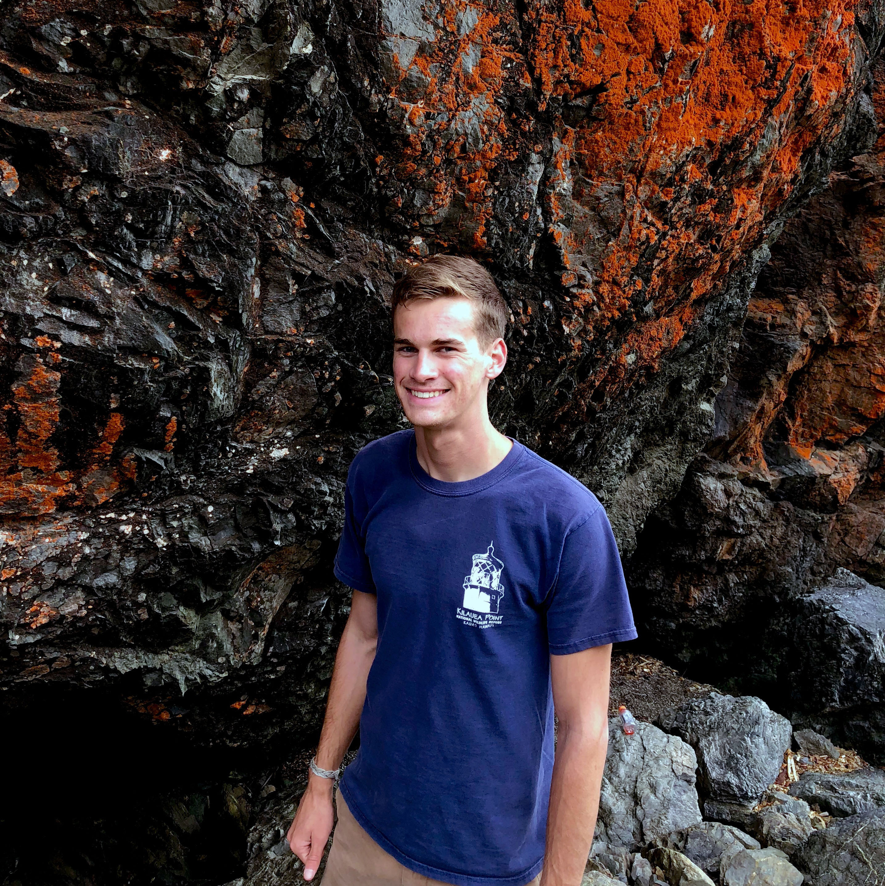

 

## Expedition Team

***

## **Anne E. Todgham**
### UC Davis, Associate Professor and Vice Chair, Department of Animal Science

>I am an environmental physiologist with an interest in understanding the molecular, biochemical and physiological mechanisms that underlie an animal's capacity to cope with environmental change.  I am fascinated by the diversity of physiological specializations (or strategies) used by animals to tolerate particular habitats that others would find very challenging.  This interest has led my research to investigate how an animal's physiology and environment interact to structure organismal stress tolerance.  My current research program has an eye towards global climate change and addresses the general question of whether contemporary animals have the physiological flexibility necessary to buffer the unprecedented rates of environmental change, specifically their response to changes in multiple environmental variables. My research focuses mainly on aquatic organisms that are distributed along the California coast and estuaries (e.g. limpets, sea urchins, crabs, oysters and intertidal fishes), but extends to Antarctic fishes and aquaculture species.

***
 

## **Ken W. Zillig**
### UC Davis, Graduate Group in Ecology, Ph.D. Candidate

> I am a fourth year in the Graduate Group in Ecology at UC Davis. My Ph.D. research revoles around interpopulation variation in Chinook salmon and how differences in the thermal biology between populations can contribute to conservation solutions. Generally, my work focuses on the role of temperature in structuring the physiology of fishes and subsequently their ecology. I especially intersted in species of conservation and commerical interest and improving the sustainability of fisheries resources.

***
 

## **Amanda J. Frazier**
### UC Davis, Animal Biology Graduate Group, Masters Student

> INSERT MANDY'S BIO HERE

***
 

## **Andrew Naslund**
### UC Davis, Marine & Coastal Sciences Major, 4th Year

> As a 4th year undergraduate marine science major at UC Davis, fish physiology has constantly fascinated me. My primary research interest is to investigate the plasticity and physiological responses of fish to anthropogenic effects such as climate change, hydrologic modifications, and fishing practices. Understanding how vulnerable species will respond to current and projected conditions is critical to effectively mitigating stress. Because Antarctic fish have persisted in a relatively stable environment, studying how rapidly changing abiotic conditions impact a fish's physiology is of great importance to our understanding of this unique marine ecosystem.

***
 